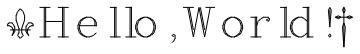

# hershey-fonts-with-unicode

Hershey vector fonts with original font class and font index
information, and a unicode mapping created by me.

I've added three things to the Hershey Fonts as they are generally known today:

1. I've attached their font classes as defined in the original documentation. (hersheyclasses.txt)
2. I've attached their font names as defined in the original documentation. (hersheyindex.txt)
3. I've attached the best related Unicode character where I could find one. (hersheyunicodemap.csv) (see also http://www.lemur.com/vkf/hershey/greek/)

You can see the results in HersheyAllGlyphs.cdf.

    ## Peter Holzmann, Octopus Enterprises
    ## USPS: 19611 La Mar Court, Cupertino, CA 95014
    ## UUCP: {hplabs!hpdsd,pyramid}!octopus!pete
    ## Phone: 408/996-7746
    ## 
    ## This distribution is made possible through the collective encouragement
    ## of the Usenet Font Consortium, a mailing list that sprang to life to get
    ## this accomplished and that will now most likely disappear into the mists
    ## of time... Thanks are especially due to Jim Hurt, who provided the packed
    ## font data for the distribution, along with a lot of other help.
    ## 
    ## This file describes the Hershey Fonts in general, along with a description of
    ## the other files in this distribution and a simple re-distribution restriction.
    ## 
    ## USE RESTRICTION:
    ##         This distribution of the Hershey Fonts may be used by anyone for
    ##         any purpose, commercial or otherwise, providing that:
    ##                 1. The following acknowledgements must be distributed with
    ##                         the font data:
    ##                         - The Hershey Fonts were originally created by Dr.
    ##                                 A. V. Hershey while working at the U. S.
    ##                                 National Bureau of Standards.
    ##                         - The format of the Font data in this distribution
    ##                                 was originally created by
    ##                                         James Hurt
    ##                                         Cognition, Inc.
    ##                                         900 Technology Park Drive
    ##                                         Billerica, MA 01821
    ##                                         (mit-eddie!ci-dandelion!hurt)
    ##                 2. The font data in this distribution may be converted into
    ##                         any other format *EXCEPT* the format distributed by
    ##                         the U.S. NTIS (which organization holds the rights
    ##                         to the distribution and use of the font data in that
    ##                         particular format). Not that anybody would really
    ##                         *want* to use their format... each point is described
    ##                         in eight bytes as "xxx yyy:", where xxx and yyy are
    ##                         the coordinate values as ASCII numbers.
    ## 
    ## *PLEASE* be reassured: The legal implications of NTIS' attempt to control
    ## a particular form of the Hershey Fonts *are* troubling. HOWEVER: We have
    ## been endlessly and repeatedly assured by NTIS that they do not care what
    ## we do with our version of the font data, they do not want to know about it,
    ## they understand that we are distributing this information all over the world,
    ## etc etc etc... but because it isn't in their *exact* distribution format, they
    ## just don't care!!! So go ahead and use the data with a clear conscience! (If
    ## you feel bad about it, take a smaller deduction for something on your taxes
    ## next week...)
    ## Peter Holzmann, Octopus Enterprises
    ## USPS: 19611 La Mar Court, Cupertino, CA 95014
    ## UUCP: {hplabs!hpdsd,pyramid}!octopus!pete
    ## Phone: 408/996-7746

# APPROACH

My primary interest was to find an accurate transliteration of the
fonts as originally published on magnetic tape by Thompson in 1976. I
wouldn't be able to read a tape even if I found one, so I searched
instead for more accessible products that are probably an accurate
transliteration of the data on tape. I eventually came across Borke's
files (found herein as ./hersheyfonts.txt), which looked to be the
cleanest of what I found while searching the web. That's where I
started.

I find it interesting that the original digital media is apparently
lost to antiquity, yet the printed documents remain easily
accessible. Thanks to OCR, it wasn't very difficult to recover data
from those early scans. It is fortunate that the authors had the
foresight to publish their font data in print form, as well as on
digitial media, as otherwise I'd have no way to verify the integity of
the data files I can find today.

I spot-checked the Borke file with Hershey and Wolcott, for both font
numbering (Borke matches the Wolcott numbering) and rendering. My
check indicated that the Borke file is a faithful rendering of the
fonts in the Wolcott paper. I did note however that font 176 in
Hershey didn't make it into the published font set, which is
unfortunate, that thing's wicked! It doesn't show up in Wolcott
either. I may type it in by hand from the coordinates, if I get bored.

The Borke file is apparently a product of GNU and Usenet work, but I
didn't find one from those sources.

I extracted the font classes and font names from Wolcott, using
copy/paste out of acrobat reader. It's OCR magic worked pretty good,
but left a few errors that I fixed by hand.

Finally, I wrote a notebook in Mathematica to render the fonts, and
display a unicode font adjacent to the hershey graphic. I iterated on
that for a while until I was satisfied that I had the unicode mapping
about as good as it's going to get.  For symbols, I took a strong bias
towards mathematical symbols, guided by Unicode technical report #25
"Unicode Support for Mathematics". You can see the results in
./HersheyAllGlyphs.cdf.

# ACKNOWLEDGEMENTS

My thanks to Dr. Hershey, Dr. Wolcott, and to those unnamed people
that archived and curated their publications for all of this
time. This is a delightful example of the value of publishing, and
especially of curating, even when the costs are today and the value,
if indeed there will be any, accrues only to the future.  I appreciate
your jobs well done. Usenet and GNU, thank you for preserving the
digitized vectors available for all of this time.

"The authors wish to acknowledge the assistance of Steve Soroka in
preparing the program to produce the pictures in Appendix B, to
Mrs. Carla Messina for the program to interface the NBS typographic
system with the Hershey system, to M. Leighton Greenough for editorial
advice, to Mrs. Constance Seymour for assistance in preparation of the
manuscript and last, but not least, to Dr. A. V, Hershey He deserves
our thanks, and that of the readers as well, not only for having
developed such a remarkably useful and important system but also for
the generosity with which he has shared the fruits of his labor with
others." - Wolcott 1976

# REFERENCES

Borke, Paul. "Hershey Vector Font based on the hershey character
set". Oct 1997. Web August 2015.  http://paulbourke.net/dataformats/hershey/hershey.zip

Hershey, A. V. "Calligraphy for Computers". 1967. U, S, Naval Weapons Laboratory.
NTRL report number AD662398. Web http://ntrl.ntis.gov August 2015.

Thompson, R.C. "A Contribution to Computer Typesetting Techniques, 9
track ASCII".  National Bureau of Standards, Washington, D.C. Office
of Standard Reference Data.  1976.  NTRL PB263925. Not available as
of August 2015.

Wolcott, N. M.; Hilsenrath, J.  "Contribution to Computer
Typesetting Techniques: Tables of Coordinates for Hershey's
Repertory of Occidental Type Fonts and Graphic
Symbols". 1976. National Bureau of Standards Department of
Commerce. NTRL report number. PB251845. Web
http://ntrl.ntis.gov (August 2015)
